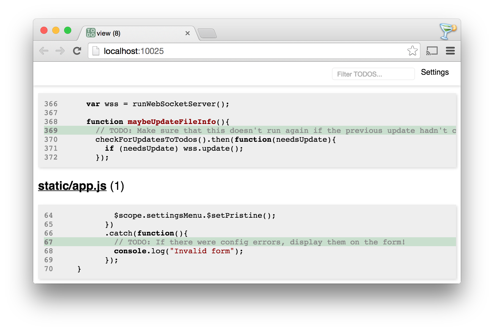

# Todoview

A simple viewer to show all TODOs found in comments in files in a directory, for the times you don't want to use bug trackers:

## Background

Many programmers I know like to leave TODOs in their code's comments to keep track of cleanup work to be done later, or to plan out how something will be implemented before writing it. It's a lightweight way to keep track of what needs to be done.

If you're a vim user, you know that vim highlights the phrase "TODO" wherever it appears:

But it's not ideal -- it's hard to see a high-level view of all outstanding TODOs across a project's directory. While you can run `find ./ -type f -print | xargs grep -n '^\s*\/\/\s*TODO'` on unix systems to get a dump of where TODOs appear, todoview brings up a nice webpage view of your TODOs.

## Installation and Usage

First, install todoview:

`sudo npm install todoview -g`

Then, run `todoview` (or just `tdv`) from the directory in which you are working. A browser window will open, displaying the TODOs in the directory.

## Acknowledgments

Thanks to [allain](https://github.com/allain) for helpful contributions!
